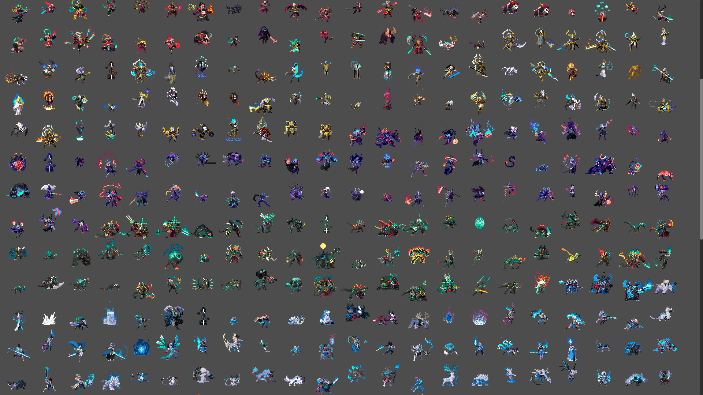
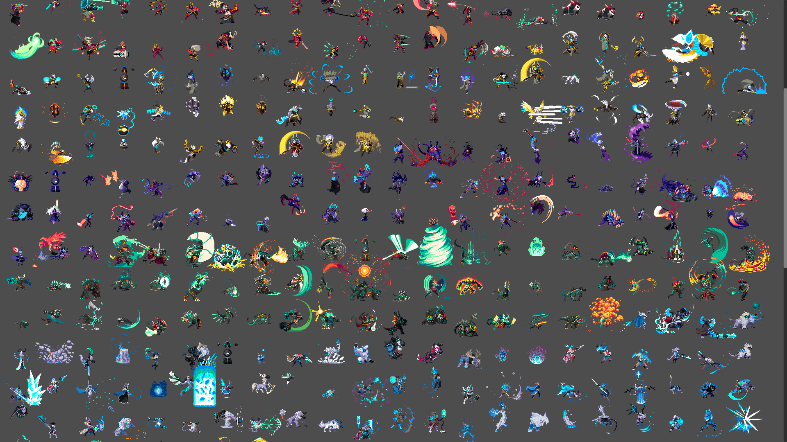
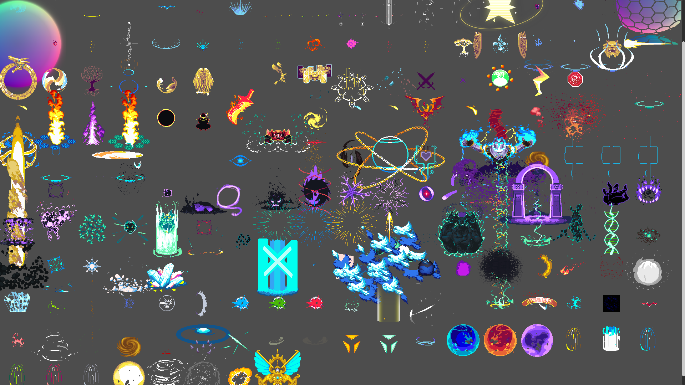

# Duelyst animated sprites repackaged for Godot 4
Spritesheets from [Open Duelyst](https://github.com/open-duelyst/duelyst) (released under the CC0 1.0 license), with the .plist XML data files parsed into Godot 4 Spriteframes resources for convenient use in AnimatedSprite2D or AnimatedSprite3D.

Duelyst is a card game, but most of the art is in the form of animated pixel art sprites. This includes more than 600 units, split between 6 factions and neutral, with attack, idle, run and death animations, as well as animated icons and effects. Suitable for use in a wide variety of 2D games.

To use, download from the asset library, or clone this repository and copy the addons folder into your project.

